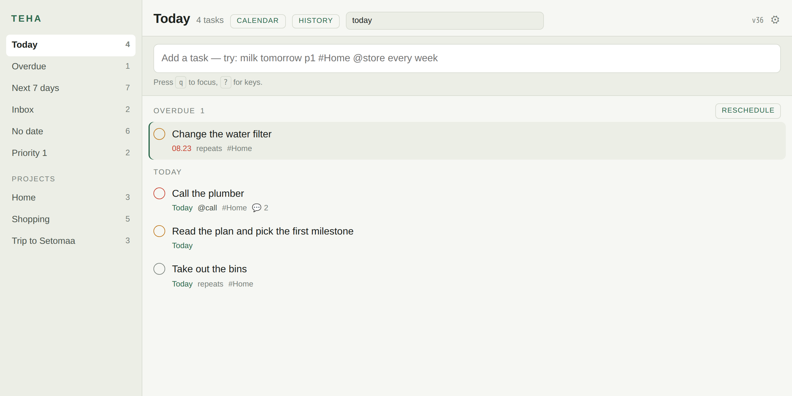
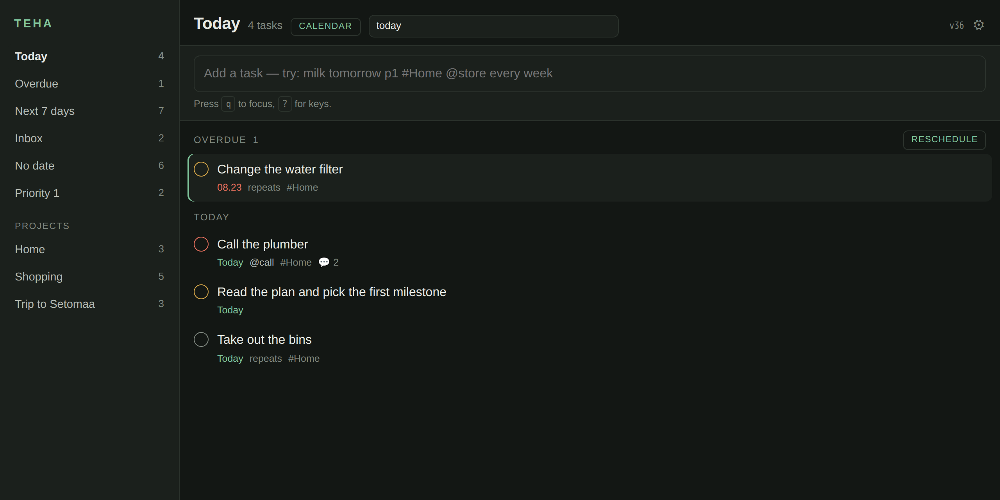
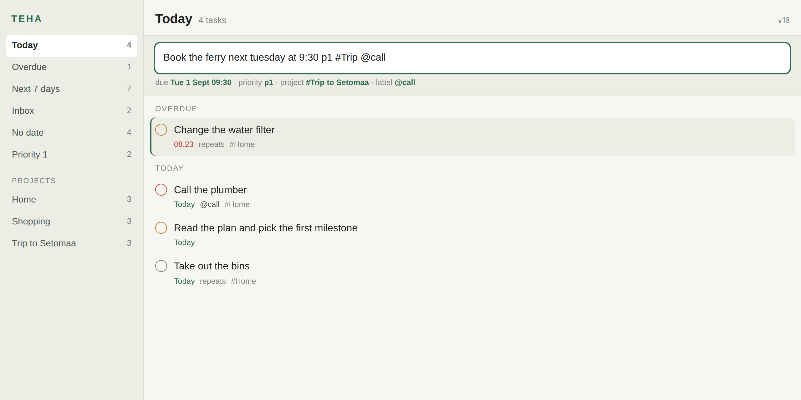
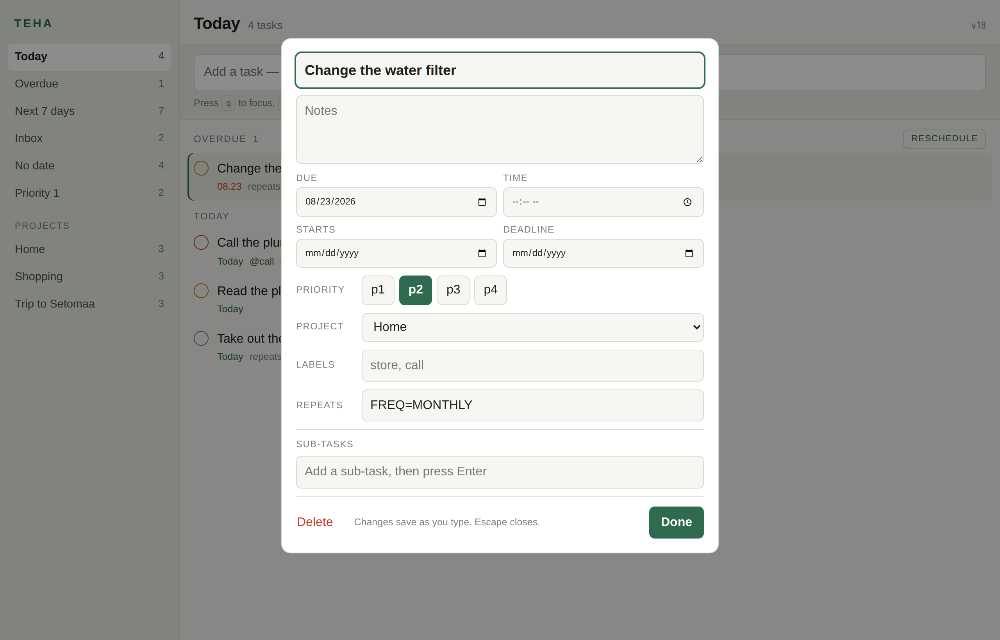
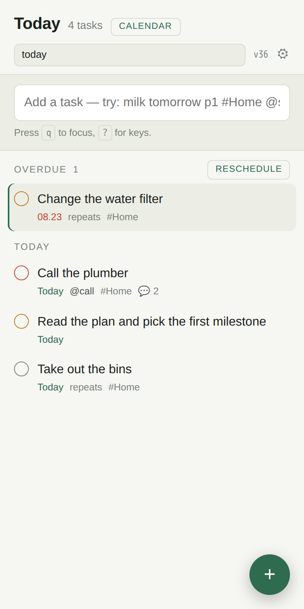
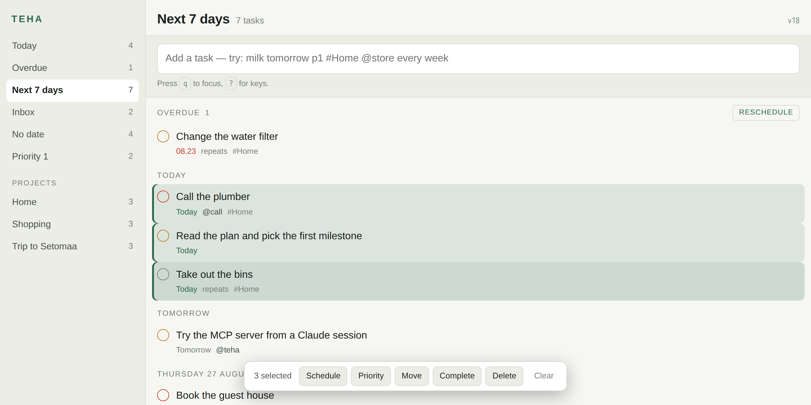

# teha

A self-hosted task manager for two people and one AI agent. One Go binary holds
the API, the sync engine, the web app and an MCP server. One SQLite file holds
the data.

*teha* is Estonian for "to do".

## What it looks like

| | |
|---|---|
|  |  |
| **Today.** Overdue first, then the day groups. The sidebar counts every view. **Reschedule** moves the whole overdue pile to one day, and `Shift+T` does it from the keyboard. | **The dark theme.** The app follows the system setting. |



**Quick add tells you what it understood, before you press Enter.** One line
carries the date, the time, the priority, the project and the labels. `#Trip`
resolves to `Trip to Setomaa` by a unique prefix. The same parser runs on the
server, in the browser and on the phone, against one shared corpus.

| | |
|---|---|
|  |  |
| **Every field, one sheet.** Start date, deadline and duration are here, and none of them is behind a paid plan. | **Phone width.** The installed web app, beside the released Android app. |



**Pick a set of tasks and act on all of them.** Hold the platform modifier and
click, or hold Shift for a run, or press `s` on each row. Schedule, priority,
move, complete and delete then work on the whole set, with one Undo. Each action
sends one command per task, so an outbox that replays it tomorrow does the same
thing. The Android app has the same five actions behind a long press.

These images are generated, never captured by hand. `scripts/screenshots.sh`
builds the server, seeds it from a fixed date, and drives a browser inside a
pinned container, so a laptop and a CI runner produce identical bytes. CI runs
the same script with `--check` and fails when the committed images no longer
match the app. A README here cannot go stale without the build going red.

## Why

Todoist is the fastest way to put a thought into a list. It is also a closed
service with a fragile API. An agent times out against it, and a sync incident
loses edits. The open-source alternatives are online-first web apps, or Android
clients on top of CalDAV. None pairs a quick add that feels like Todoist with an
MCP server that an agent can drive for a whole session.

## Status

Proof of concept. The server, the sync engine, the filter language, the web app,
the MCP server and the Android app run. Reminders reach the browser and the
installed web app through Web Push. The macOS app, sharing and a second account
do not exist yet. Read [docs/PLAN.md](docs/PLAN.md) for the phased plan and
[docs/POC.md](docs/POC.md) for what this build proves and what it does not.

## Run it

```sh
go build -o teha ./cmd/teha       # one static binary, no cgo
./teha -db teha.db -seed          # example data, optional
./teha -db teha.db -dev           # http://127.0.0.1:8637, no token
```

With a token, which is what a public host needs:

```sh
TEHA_TOKEN=$(openssl rand -hex 32) ./teha -db teha.db -addr 127.0.0.1:8637
```

The token guards the API, the MCP endpoint and the web app. The browser asks for
it once and keeps it in a cookie. Passkeys replace this in a later milestone.

## What works today

- **Quick add in one line.** `Call the plumber tomorrow at 9 p1 #Home @call every week`
  parses on the client, so the task appears before any network call.
- **Offline first.** Every edit lands in the local store and an outbox. The app
  works with the server down and drains the outbox when the server returns.
- **One filter language** in the app, the API and the MCP tools: `today`,
  `overdue`, `#Project`, `##Project`, `%label`, `p1`, `no date`, `recurring`,
  `search:`, `before:`, `deadline:`, with `&`, `|`, `!` and parentheses.
- **Recurrence** as RFC 5545 RRULE. A repeating task moves to its next date on
  completion, and a task months overdue moves to its next real slot.
- **MCP server** at `/mcp`, specification revision 2026-07-28, stateless. Eight
  tools, batch writes, compact results. The daily plan costs one call and about
  460 bytes.
- **Keyboard**: `q` quick add, `j`/`k` move, `x` complete, `e` open the detail,
  `1`..`4` priority, `t`/`m`/`w` schedule, `u` undo, `?` the key list.

## Measured

| Case | Result |
|---|---|
| 10 000 tasks, filter query, 200 rows | 1 to 5 ms |
| Full pull of 10 011 tasks | 53 ms, 1.4 MB |
| One write plus the pull that follows | 3 ms |
| MCP `plan_day` | 459 bytes, about 114 tokens |
| MCP `list_tasks`, default page of 50 | about 1 200 tokens |
| Write throughput | 200 commands per request, 5 000 tasks in 6 s |

## Layout

```
Apache-2.0, the shared contract every client links:

  id                short sortable identifiers
  filter            the filter language, compiled to SQL
  recur             RRULE handling
  quickadd          the quick add parser
  mobile            the gomobile binding for Android and iOS
  parser-fixtures   the shared corpus, one contract for every client

AGPL-3.0-or-later, the server:

  cmd/teha          the binary: server, seed, import, command line client
  internal/store    SQLite schema, commands, sync, queries
  internal/api      HTTP: /v1/sync, /v1/tasks, /v1/projects, /v1/labels,
                    /v1/events, /v1/export, /v1/health
  internal/mcpsrv   the MCP server and its tools
  internal/webui    the web app, embedded in the binary
  internal/todoist  the Todoist importer
  docs              the plan, the decisions, the research and the deploy guide
```

## Use it

[docs/USAGE.md](docs/USAGE.md) is the guide: the server flags, the quick add
syntax, the filter grammar, every command line subcommand, the MCP tools and
the Todoist import. Every example in it was captured from a running server.

## Test

```sh
go test ./...                                    # server, filter, sync, MCP
node --test internal/webui/assets/parse.test.mjs # the quick add corpus
```

## Licence

Two licences, split by tree. The server is AGPL-3.0-or-later. The four shared
packages and the parser corpus are Apache-2.0, so that a native client can link
them and still reach an app store.

Read [LICENSING.md](LICENSING.md) for the rule and [docs/DECISIONS.md](docs/DECISIONS.md)
for the reasoning.
