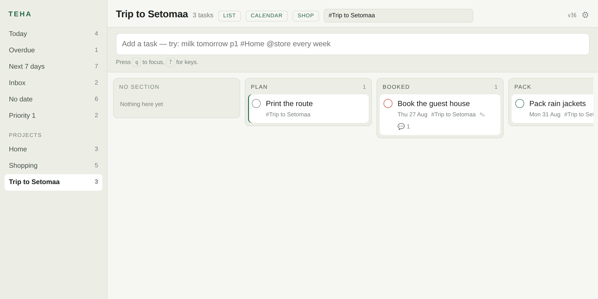
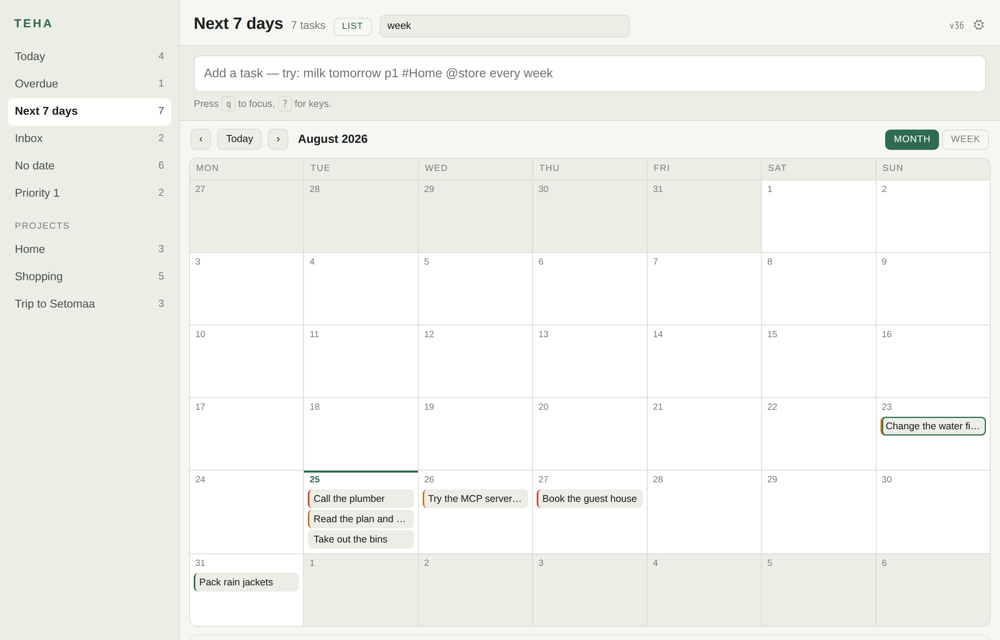
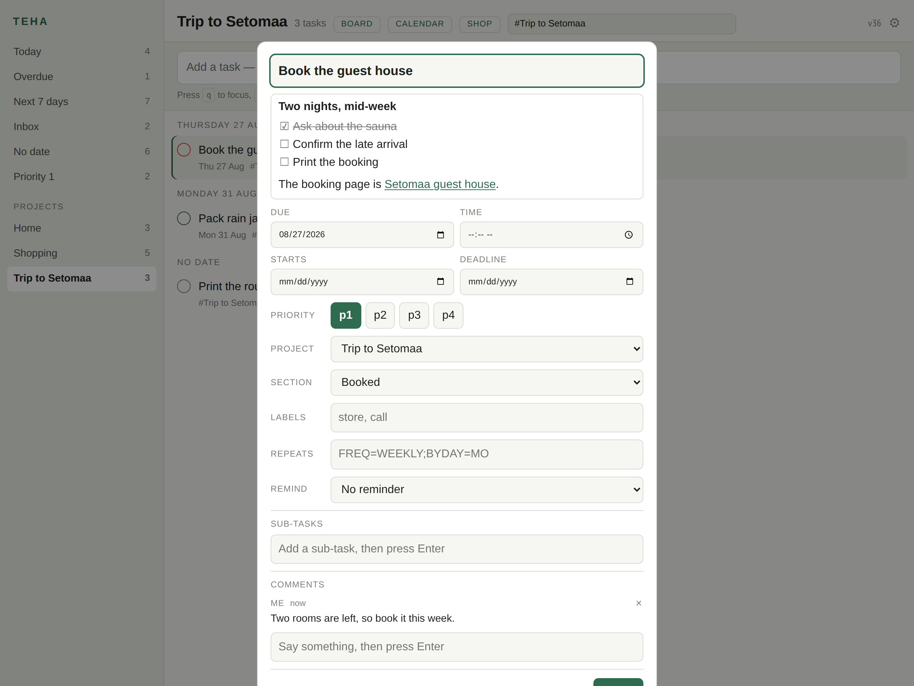
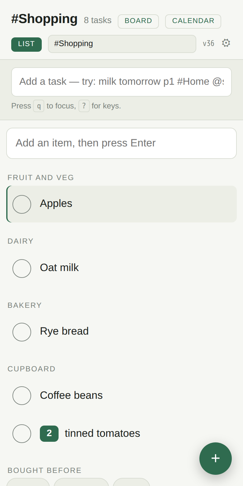
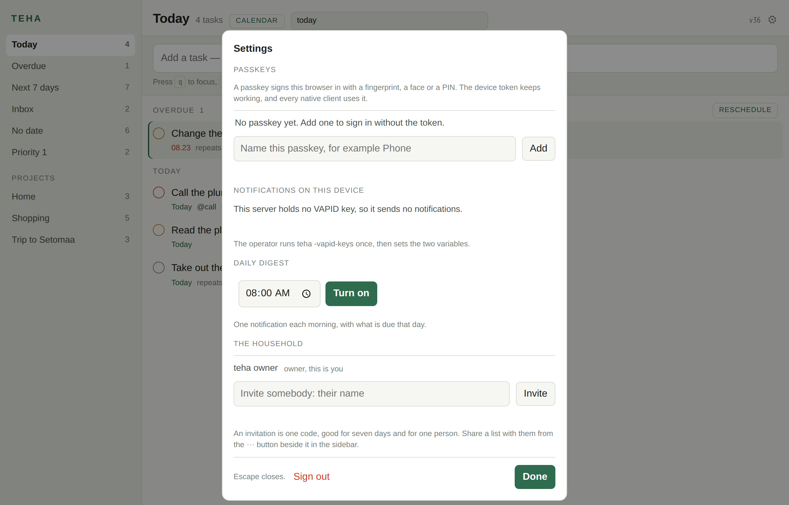

# teha

A self-hosted task manager for two people and one AI agent. One Go binary holds
the API, the sync engine, the web app and an MCP server. One SQLite file holds
the data.

*teha* is Estonian for "to do".

## What it looks like

| | |
|---|---|
|  |  |
| **Today.** Overdue first, then the day groups. The sidebar counts every view. **Reschedule** moves the whole overdue pile to one day, and `Shift+T` does it from the keyboard. | **The dark theme.** The app follows the system setting. |


**Quick add tells you what it understood, before you press Enter.** One line
carries the date, the time, the priority, the project and the labels. `#Trip`
resolves to `Trip to Setomaa` by a unique prefix. The same parser runs on the
server, in the browser and on the phone, against one shared corpus.

| | |
|---|---|
|  |  |
| **Every field, one sheet.** Start date, deadline and duration are here, and none of them is behind a paid plan. | **Phone width.** The installed web app, beside the released Android app. |

| | |
|---|---|
|  |  |
| **A board.** `b` swaps a project for its sections as columns. Drag a card, or move it with the keyboard. | **A month, or a week.** `c` swaps any view for the calendar. Drag a task to another day, and drag one out of the strip below to give it a day. |

| | |
|---|---|
|  |  |
| **A note is Markdown, and a task has a conversation.** The note reads as Markdown and edits as plain text. A comment carries who said it, renders as Markdown too, and only its author can change it. | **Shopping mode.** `S` draws a list the way a shop needs it: one heading per aisle, big targets, `2x milk` as a chip, and what you buy often one tap away. |

**A note is Markdown.** It reads as Markdown and edits as plain text: a
heading, a list, a task list, code and a link that opens. Paste a URL over
selected text and it becomes a link. The renderer escapes the text first and
refuses a target that is not `http`, `https` or `mailto`, so nothing in a note
can reach the page as markup.

**Shopping mode needed no new table.** An aisle is a section of the project,
which is the same heading the board draws as a column. A new item goes into the
aisle of the last item of that name, so `milk` lands in Dairy from the second
time on. The basket holds this trip, and one button empties it. The screenshot
job fails the build if the layout scrolls sideways at 320 pixels, because the
shop's own app is often open beside it.


**Pick a set of tasks and act on all of them.** Hold the platform modifier and
click, or hold Shift for a run, or press `s` on each row. Schedule, priority,
move, complete and delete then work on the whole set, with one Undo. Each action
sends one command per task, so an outbox that replays it tomorrow does the same
thing. The Android app has the same five actions behind a long press.



**Two people, one file.** The owner writes an invitation with a name on it, and
the code is shown once. The other person joins with it and gets an account of
their own: their own inbox, their own device token, their own reminders. A list
reaches them only when somebody shares it, from the `⋯` button beside it in the
sidebar.

These images are generated, never captured by hand. `scripts/screenshots.sh`
builds the server, seeds it from a fixed date, and drives a browser inside a
pinned container, so a laptop and a CI runner produce identical bytes. CI runs
the same script with `--check` and fails when the committed images no longer
match the app. A README here cannot go stale without the build going red.

## Why

Todoist is the fastest way to put a thought into a list. It is also a closed
service with a fragile API. An agent times out against it, and a sync incident
loses edits. The open-source alternatives are online-first web apps, or Android
clients on top of CalDAV. None pairs a quick add that feels like Todoist with an
MCP server that an agent can drive for a whole session.

## Status

Proof of concept. The server, the sync engine, the filter language, the web app,
the MCP server, the Android app and the macOS shell run. The browser signs in
with a passkey, and reminders reach it through Web Push. The phone reaches the
same six views as the browser, one view per project, and any filter you type.
The macOS shell adds a global quick add, a menu bar icon and the `teha://`
scheme around the same web app.

**Two people can now share a list.** An invitation makes a second account with
its own inbox and its own device token, a project is shared from the sidebar, a
task carries an assignee, and every read and write is scoped to the account
that asked. The phone is the one client that has not joined the household yet.

Read [docs/PLAN.md](docs/PLAN.md) for the phased plan and
[docs/POC.md](docs/POC.md) for what this build proves and what it does not.

## Run it

```sh
go build -o teha ./cmd/teha       # one static binary, no cgo
./teha -db teha.db -seed          # example data, optional
./teha -db teha.db -dev           # http://127.0.0.1:8637, no token
```

With a token, which is what a public host needs:

```sh
TEHA_TOKEN=$(openssl rand -hex 32) ./teha -db teha.db -addr 127.0.0.1:8637
```

The token guards the API, the MCP endpoint and the web app. The browser asks for
it once and keeps it in a cookie.

The browser can also use a passkey. Open **Settings** in the app, name the
passkey and press **Add**. The sign-in page then has a **Sign in with a passkey**
button, and the token box stays below it as the fallback. Enrolment asks for the
device token, so only a person who already holds it can add a passkey. On a
public hostname, name the relying party:

```sh
TEHA_RP_ID=teha.example TEHA_ORIGIN=https://teha.example ./teha -db teha.db
```

Both values default to the request host, so a run on `localhost` needs neither.

## What works today

- **Quick add in one line.** `Call the plumber tomorrow at 9 p1 #Home @call every week`
  parses on the client, so the task appears before any network call.
- **Offline first.** Every edit lands in the local store and an outbox. The app
  works with the server down and drains the outbox when the server returns.
- **A household of two.** The owner writes an invitation with a name on it, and
  the code works once. The other person joins, in the browser or on the phone,
  keeps their own inbox and their own token, and sees a list only when somebody
  shares it. A task in a shared list carries an assignee, and `assigned to: me`
  is a view.
- **A conversation on a task.** A comment is a row with an author. Everybody
  who can see the task reads the talk, only the author changes their own line,
  and `comment: words` finds a task by what was said on it.
- **A notification when it matters.** A task given to you, and a comment on a
  task you can see, both reach your devices. Your own action is silent.
- **Shopping mode.** `S` draws a project the way a shop needs it: one heading
  per aisle, big targets, `2x milk` as a chip, the things you buy often one tap
  away, and a basket that empties on request. Two phones in one shop see each
  other's ticks.
- **One filter language** in the app, the phone, the API and the MCP tools:
  `today`, `overdue`, `#Project`, `##Project`, `/Section`, `%label`, `p1`,
  `no date`, `no section`, `recurring`, `search:`, `before:`, `deadline:`, with
  `&`, `|`, `!` and parentheses. One compiler serves the server and the phone:
  it takes the table and column names as a value, so one grammar reads two
  databases, and the browser reads the same grammar over its local rows. One
  corpus of eighty-one queries holds all three to the same answers. A term a
  client cannot answer says so in a sentence: the phone has no comment table,
  and no client but the server keeps a creation date.
- **Recurrence** as RFC 5545 RRULE. A repeating task moves to its next date on
  completion, and a task months overdue moves to its next real slot.
- **Reminders in one line.** `Call the bank tomorrow remind me at 8`, or
  `remind me 30 minutes before`. The reminder follows the task when the date
  moves.
- **MCP server** at `/mcp`, specification revision 2026-07-28, stateless. Ten
  tools, batch writes, compact results. The daily plan costs one call and about
  460 bytes. An agent can read the comments on a task and leave one.
- **Passkeys** for the browser, beside the device token. WebAuthn with a
  discoverable credential and required user verification, a session cookie of
  its own, and a lockout after repeated failures.
- **Sections and a board.** A project holds sections. `b` swaps the list for a
  board of columns, and the choice survives a reload. Drag a card to another
  column, or drive the whole board from the keyboard.
- **A calendar.** `c` swaps any view for a month or a week. Drag a task to
  another day, or drag one out of the strip of undated tasks to give it a day.
- **Markdown in a note,** with a link that opens. Paste a URL over selected
  text and it becomes a link. A comment renders the same way.
- **A local copy that can grow.** The browser keeps its rows in IndexedDB, one
  object store per table, and writes the rows that changed rather than the
  whole account.
- **A backup that has been restored.** `scripts/restore-drill.sh` destroys the
  database and brings it back from the replica, in Docker, in about a minute.
  The first run of it found that the backup had been replicating a stale file.
- **Keyboard**: `q` quick add, `/` filter, `j`/`k` move, `x` complete, `e` open
  the detail, `1`..`4` priority, `t`/`m`/`w` schedule, `b` board, `c` calendar,
  `S` shop, `u` undo, `,` settings, `?` the key list.

## Measured

| Case | Result |
|---|---|
| 10 000 tasks, filter query, 200 rows | 1 to 5 ms |
| Full pull of 10 011 tasks | 53 ms, 1.4 MB |
| One write plus the pull that follows | 3 ms |
| MCP `plan_day` | 459 bytes, about 114 tokens |
| MCP `list_tasks`, default page of 50 | about 1 200 tokens |
| Write throughput | 200 commands per request, 5 000 tasks in 6 s |

## Layout

```
Apache-2.0, the shared contract every client links:

  id                short sortable identifiers
  filter            the filter language, compiled to SQL
  order             the fractional index for a manual order
  recur             RRULE handling
  quickadd          the quick add parser
  mobile            the gomobile binding for Android and iOS
  parser-fixtures   three shared corpora: quick add, filters, Markdown

Apache-2.0, the clients:

  desktop           the macOS shell: quick add, the menu bar, teha://

AGPL-3.0-or-later, the server:

  cmd/teha          the binary: server, seed, import, command line client
  internal/store    SQLite schema, commands, sync, queries, the household
  internal/api      HTTP: /v1/sync, /v1/tasks, /v1/projects, /v1/sections,
                    /v1/labels, /v1/events, /v1/export, /v1/health,
                    /v1/passkeys, /v1/household, /v1/invites, /v1/join,
                    /v1/share
  internal/push     the reminder scheduler and Web Push
  internal/mcpsrv   the MCP server and its tools, one tool set per account
  internal/webui    the web app, embedded in the binary
  internal/todoist  the Todoist importer
  scripts           the screenshot job and the restore drill
  docs              the plan, the decisions, the research and the deploy guide
```

## Use it

[docs/USAGE.md](docs/USAGE.md) is the guide: the server flags, the quick add
syntax, the filter grammar, every command line subcommand, the MCP tools and
the Todoist import. Every example in it was captured from a running server.

## Test

```sh
go test ./...                                  # server, filter, sync, MCP, the household
node --test internal/webui/assets/*.test.mjs   # quick add, filters, Markdown
scripts/screenshots.sh --check                 # the README images match the app
scripts/restore-drill.sh                       # destroy the database, restore it, compare
```

The three corpora in `parser-fixtures/` are the contracts between the clients.
`quickadd.json` holds the quick add cases, `filter.json` holds one account and
eighty-one queries with the answer that real SQLite gave, and `markdown.json`
holds what a note renders to. A change to any grammar starts with a case
there.

## Licence

Two licences, split by tree. The server is AGPL-3.0-or-later. The four shared
packages and the parser corpus are Apache-2.0, so that a native client can link
them and still reach an app store.

Read [LICENSING.md](LICENSING.md) for the rule and [docs/DECISIONS.md](docs/DECISIONS.md)
for the reasoning.
